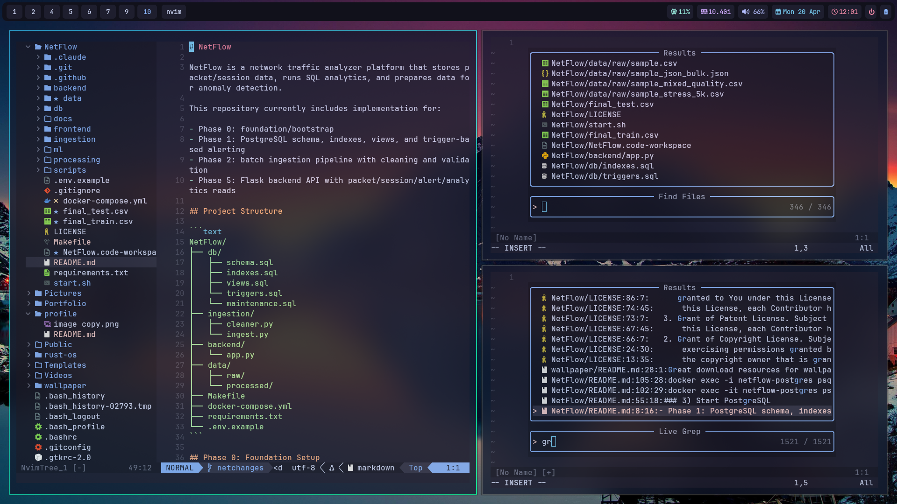

<!--
Personalization checklist:
1) If your GitHub username is not "varshith", replace it in all stats links.
2) Update social links in the Connect section.
3) Replace setup placeholders with your real setup screenshots.
-->

  <h1>I'm feeling kinda ''y</h1>

  

  
  
  

  
  
  

## About

- Building full stack products with a strong focus on polish, performance, and maintainability.
- Turning ideas into reliable shipped features with practical architecture.
- Interested in developer tools, automation workflows, and modern web experiences.
- Constantly improving systems, processes, and product quality.

 

## Tech Arsenal

### Languages

  
  
  
  
  
  

### Frameworks

  
  
  
  

### Tooling and DevOps

  
  
  
  

## In The Flow

  
  

## Setup Gallery

My current battlestation and workflow space.

  

## GitHub Stats

  
  

  
  

## Connect

  
  
  

  <strong>"Build with intent. Ship with confidence."</strong>

